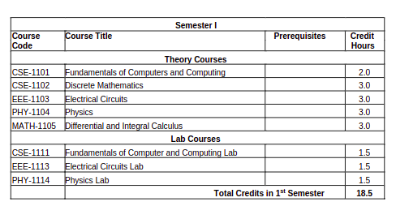
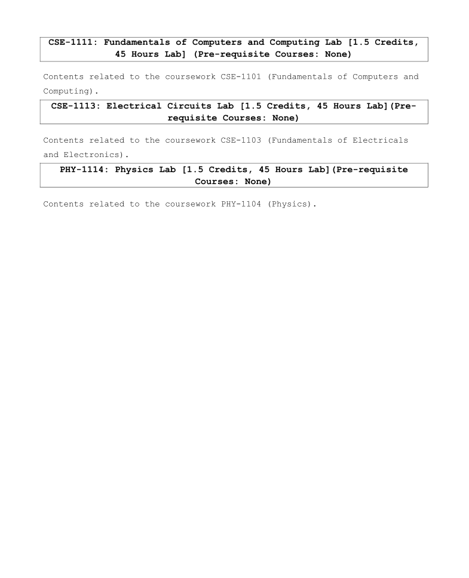

## 🎓 Semester I — 1st Year 1st Semester

### 📘 Theory Courses

- 🔗 [**CSE-1101: Fundamentals of Computers and Computing**](./cse_1101/)
- 🔗 [**CSE-1102: Discrete Mathematics**](./cse_1102/)
- 🔗 [**EEE-1103: Electrical Circuits**](./eee_1103/)
- 🔗 [**PHY-1104: Physics**](./phy_1104/)
- 🔗 [**MATH-1105: Differential and Integral Calculus**](./math_1105/)

---

### 🧪 Lab Courses

- **CSE-1111: Fundamentals of Computers and Computing Lab**  
  🖥️ *Focus:* Learned **C Programming Language**  
  🔗 [C Programming Bootcamp](https://github.com/eyasir329/c_programming_bootcamp)

- **EEE-1113: Electrical Circuits Lab**  
  ✅ [Kirchhoff’s Current and Voltage Law (KCL & KVL)](./lab_report/labreport1.pdf)  
  ✅ [Current Calculation in Circuit](./lab_report/labreport2.pdf)  
  ✅ [Superposition Theorem Verification](./lab_report/labreport3.pdf)  
  ✅ [Thevenin’s Theorem Verification](./lab_report/labreport4.pdf)  
  ✅ [Norton’s Theorem Verification](./lab_report/labreport5.pdf)

- **PHY-1114: Physics Lab**  
  🔬 [Acceleration due to Gravity (Compound Pendulum)](./lab_report/physics%20lab%20report%201.pdf)  
  🔬 [Wavelength of Sodium Light (Newton’s Rings)](./lab_report/physics%20lab%20report%202.pdf)  
  🔬 [Spectral Lines from Discharge Tube (Diffraction Grating)](./lab_report/physics%20lab%20report%203.pdf)

---

### 📄 Course Outline Preview

---

### 📚 Detailed Syllabus Snapshots

---