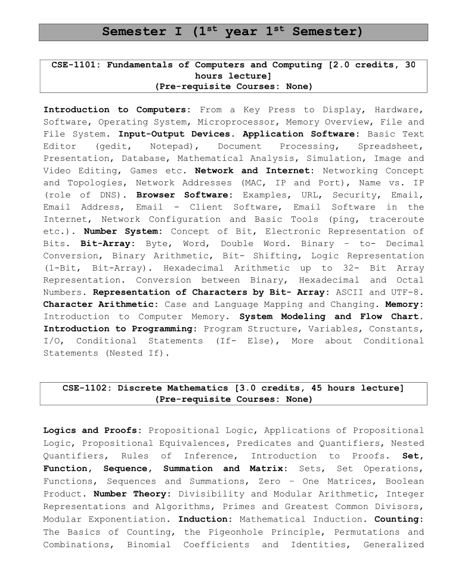

## 📘 CSE-1102: Discrete Mathematics

### 👩‍🏫 Course Teacher

**Mala Rani Barman**  
Lecturer, Dept. of CSE, Sheikh Hasina University

---

### 📚 Reference Book

- **SCHAUM’S OUTLINE: Discrete Mathematics** (3rd Edition)

---

### 🧠 Topics Covered

#### 🔍 Logics and Proofs

- Propositional Logic
- Applications of Propositional Logic
- Propositional Equivalences
- Predicates and Quantifiers
- Nested Quantifiers
- Rules of Inference
- Introduction to Proofs

📄 [Chapter 02: Propositions, Propositional Equivalences](./slides/Chapter_02.pdf)  
📄 [Chapter 03: Rules of Inference](./slides/Chapter_03.pdf)

---

#### 📚 Set, Function, Sequence, Summation, and Matrix

- Sets & Set Operations
- Functions
- Sequences and Summations
- Zero–One Matrices
- Boolean Product

📄 [Chapter 01: Introduction, Set Theory, Inclusion-Exclusion](./slides/Chapter_01.pdf)

---

#### 🔢 Number Theory

- Divisibility and Modular Arithmetic
- Integer Representations and Algorithms
- Primes and GCD
- Modular Exponentiation

---

#### 🧮 Mathematical Induction

📄 [Chapter 05: Mathematical Induction](./slides/Chapter_05.pdf)

---

#### 🔢 Counting

- Basics of Counting
- Pigeonhole Principle
- Permutations and Combinations
- Binomial Coefficients and Identities
- Generalized Permutations and Combinations

📄 [Chapter 06: Counting](./slides/Chapter_06.pdf)

---

#### 🔁 Recursion

- Applications of Recurrence Relations

---

#### ➕ Inclusion-Exclusion

- Principle of Inclusion–Exclusion

---

#### 🔗 Relations

- Relations and Their Properties
- Representing Relations

📄 [Chapter 04: Relations](./slides/Chapter_04.pdf)

---

#### 🕸️ Graphs

- Graphs and Graph Models
- Terminologies & Special Types
- Euler & Hamilton Paths

---

#### 🌲 Trees

- Introduction to Trees

---

### 🗂️ Syllabus Preview

  

---
