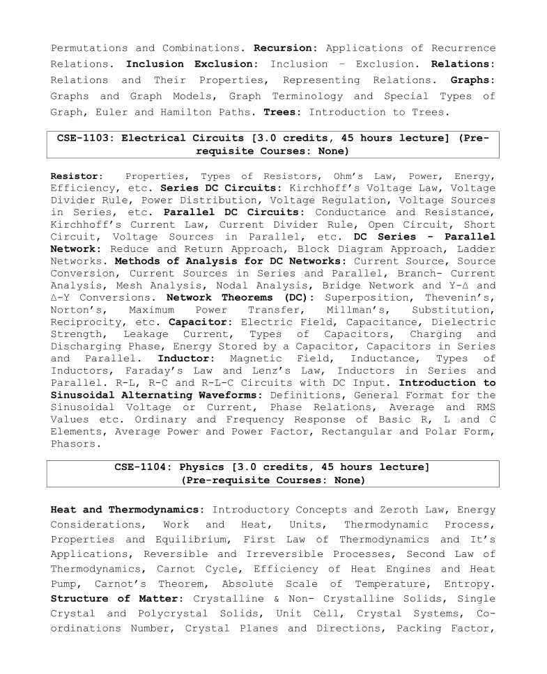
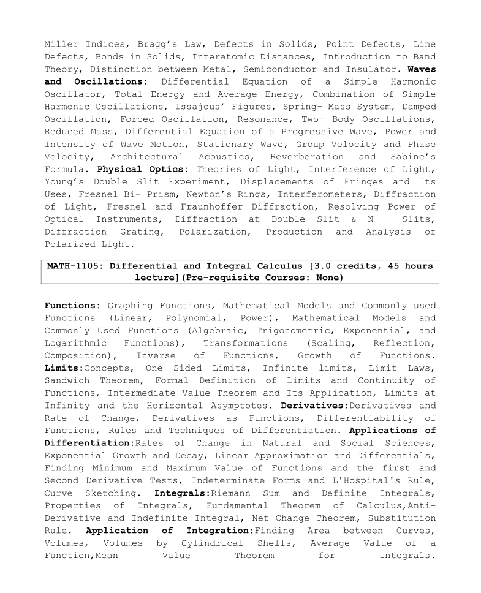

## 📘 PHY-1104: Physics

### 👨‍🏫 Course Teacher

**Md. Babul Chandra Roy**

---

### 📚 Reference Books

- **Fundamentals of Physics**, by David Halliday, Jearl Walker, Robert Resnick
- **Heat Thermodynamics and Statistical Physics**, by Brij Lal, N Subrahmanyam, PS Hemne

---

### 📑 Topics Covered

#### 🌡️ Heat and Thermodynamics

- Introductory Concepts and Zeroth Law
- Energy Considerations
- Work and Heat
- Units, Thermodynamic Processes, Properties, and Equilibrium
- First Law of Thermodynamics and Its Applications
- Reversible and Irreversible Processes
- Second Law of Thermodynamics
- Carnot Cycle and Efficiency of Heat Engines and Heat Pumps
- Carnot’s Theorem
- Absolute Scale of Temperature
- Entropy

📄 [Heat and Thermodynamics](./slides/Lecture%201.pdf)

---

#### 🏗️ Structure of Matter

- Crystalline & Non-Crystalline Solids
- Single Crystal and Polycrystalline Solids
- Unit Cell and Crystal Systems
- Coordination Number
- Crystal Planes and Directions
- Packing Factor
- Miller Indices and Bragg’s Law
- Defects in Solids (Point and Line Defects)
- Bonds in Solids
- Interatomic Distances
- Introduction to Band Theory
- Distinction between Metals, Semiconductors, and Insulators

📄 [Structure of Matter](./slides/Lecture%202.pdf)

---

#### 🌊 Waves and Oscillations

- Differential Equation of a Simple Harmonic Oscillator
- Total Energy and Average Energy
- Combination of Simple Harmonic Oscillations (Issajous Figures)
- Spring-Mass System
- Damped and Forced Oscillation
- Resonance and Two-Body Oscillations
- Reduced Mass
- Differential Equation of a Progressive Wave
- Power and Intensity of Wave Motion
- Stationary Wave
- Group and Phase Velocity
- Architectural Acoustics, Reverberation, and Sabine’s Formula

📄 [Wave and Oscillation](./slides/Lecture%204.pdf)

---

#### 💡 Physical Optics

- Theories of Light
- Interference of Light
- Young’s Double Slit Experiment and Fringes
- Fresnel Bi-Prism and Newton’s Rings
- Interferometers
- Diffraction of Light (Fresnel and Fraunhofer Diffraction)
- Resolving Power of Optical Instruments
- Diffraction at Double Slit & N-Slits
- Diffraction Grating
- Polarization and Production/Analysis of Polarized Light

📄 [Physical Optics](./slides/Lecture%203.pdf)

---

### 🗂️ Syllabus Preview

  

---
