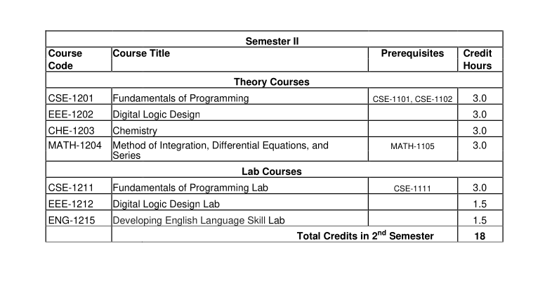
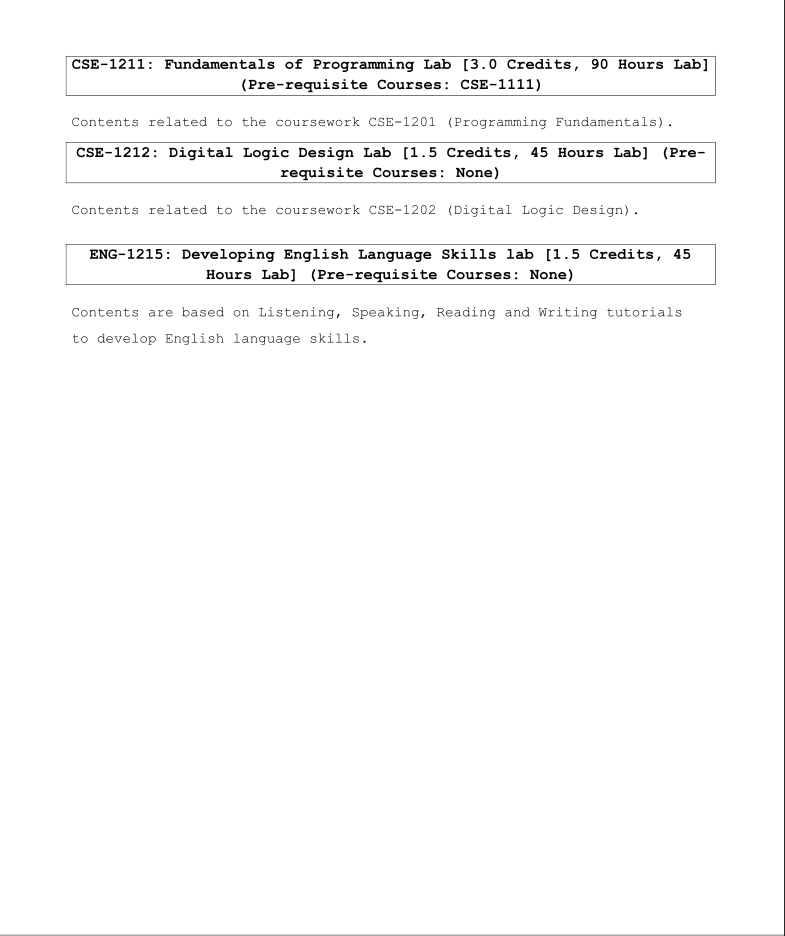

## Semester II (1st Year 2nd Semester)

- [CSE-1201: Fundamentals of Programming](./cse_1201/)
- [EEE-1202: Digital Logic Design](./eee_1202/)
- [CHE-1203: Chemistry](./che_1203/)
- [MATH-1204: Methods of Integration, Differential Equations and Series](./math_1204/)
- CSE-1211: Fundamentals of Programming Lab

      As a part of this lab, I learn C++ Programming Languages.

  [C++ Programming BootCamp](https://github.com/eyasir329/cpp_bootcamp)

- EEE-1212: Digital Logic Design Lab

  - [4 Bit Adder](https://www.tinkercad.com/things/chufPpuHVxk-4-bit-adder)
  - [4 Bit Up Counter](https://www.tinkercad.com/things/0Yz7RA1iZ8I-4-bit-up-counter)
  - [4 Bit Down Counter](https://www.tinkercad.com/things/fnZWudZZxJU-4-bit-down-counter)
  - [0-11 Count](https://www.tinkercad.com/things/2AdEorJ6rTl-0-11-count)
  - [4 Bit Up-Down Counter](https://www.tinkercad.com/things/ahlJz8JvFqe-4-bit-up-down-counter)
  - [4 Bit Left-Right Shift](https://www.tinkercad.com/things/6y3vhPRFAnY-4-bit-right-left-shift-resister)
  - [15-5 Counter](https://www.tinkercad.com/things/29pA5XuIz4p-15-5-counter)
  - [4 Bit Adder-Subtractor](https://www.tinkercad.com/things/8rpk3xoMnU4-4-bit-adder-amp-subtractor)
  - [Adder-Subtractor Using Full-Adder](https://www.tinkercad.com/things/hVa0wBVIJxq-full-adder-addersubtractor)
  - [Two Way Parallel Load](https://www.tinkercad.com/things/7B6xjNVazBu-two-way-parallel-load)

  ```
  As a part of this lab, i make a practical
  4 bit adder-subtractor circuits.
  ```

- [ENG-1215: Developing English Language Skills lab](./eng_1215/)

### Course Outline:



### Details Syllabus of my 2nd semester:



