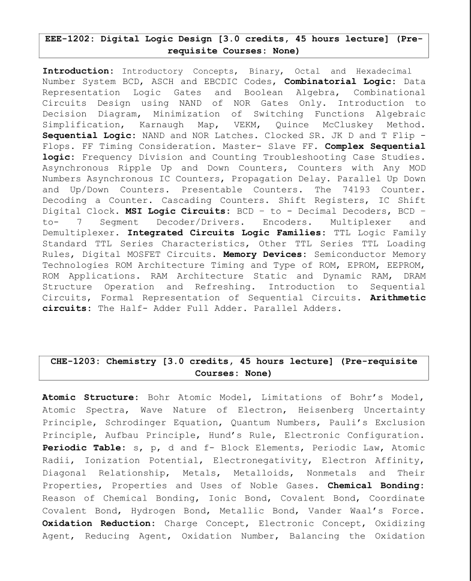

## 🧪 CHE-1203: Chemistry

### 👨‍🏫 Course Teacher  
**Professor Dr. Md. Aftab Ali Shaikh**  
Department of Chemistry, University of Dhaka

---

## 📘 Course Topics & Slides

### 🔹 Atomic Structure
- Bohr Atomic Model & its Limitations  
- Atomic Spectra  
- Wave Nature of Electron  
- Heisenberg Uncertainty Principle  
- Schrödinger Equation & Quantum Numbers  
- Pauli Exclusion Principle, Aufbau Principle, Hund’s Rule  
- Electronic Configuration  
📄 [**Lecture Slide**](./slides/Lecture%201%20(Atomic%20Structure).pdf)

---

### 🔹 Periodic Table
- s, p, d, f Block Elements  
- Periodic Law, Atomic Radii, Ionization Potential  
- Electronegativity, Electron Affinity  
- Diagonal Relationship  
- Metals, Metalloids, Nonmetals  
- Noble Gases: Properties & Uses  
📄 [**Lecture Slide**](./slides/Lecture%203%20(Periodic%20table).pdf)

---

### 🔹 Chemical Bonding
- Reasons for Bond Formation  
- Ionic, Covalent, Coordinate Covalent Bonds  
- Hydrogen & Metallic Bonds  
- van der Waals Forces  
📄 [**Lecture Slide**](./slides/Lecture%202%20(Chemical%20bond).pdf)

---

### 🔹 Oxidation & Reduction
- Charge & Electronic Concepts  
- Oxidizing/Reducing Agents  
- Oxidation Numbers  
- Balancing Redox Equations  
📄 [**Lecture Slide**](./slides/Lecture%205%20(Oxidation%20reduction).pdf)

---

### 🔹 Acid-Base Concepts
- Bronsted & Lewis Concepts  
- Ionization of Water, pH  
- Neutralization Curve, Indicators, Buffer  
- Henderson Equation  
📄 [**Lecture Slide**](./slides/Lecture%204%20(Acids%20Base).pdf)

---

### 🔹 State of Matter
- Boyle’s, Charles’, Avogadro’s Laws  
- Ideal vs Real Gases  
- Kinetic Theory  
- van der Waals Equation  
📄 [**Lecture Slide**](./slides/Lecture%207%20(State%20matters).pdf)

---

### 🔹 Phase Rule
- Definitions  
- Phase Diagrams of Water & CO₂  
📄 [**Lecture Slide**](./slides/Lecture%208%20(Phase%20rule).pdf)

---

### 🔹 Thermodynamics
- First Law, Work & Heat  
- Thermochemistry  
- Second & Third Laws, Carnot Cycle  
📄 [**Lecture Slide**](./slides/Lecture%206%20(Thermodynamics).pdf)

---

### 🔹 Chemical Kinetics
- Rate Laws & Rate Equations  
- Molecularity & Reaction Order  
- Derivations for First & Second Order  
- Half-Life & Pseudo First-Order Reactions  

---

### 🔹 Chemical Equilibrium
- Dynamic Nature  
- Law of Mass Action  
- Equilibrium Constant  
- Le Chatelier’s Principle & Applications  

---

### 🔹 Solutions
- Types of Solutions  
- Colligative Properties  

---

### 🔹 Electrochemistry
- Electrolysis & Electrolytes  
- Electrochemical Cells  
- Faraday’s Law  
- Nernst Equation & Applications  

---

### 🔹 Biomolecules
- Carbohydrates  
- Proteins  
- Nucleic Acids  
- Polymers & Polymerization  

---

## 🗂️ Syllabus Preview

 

---