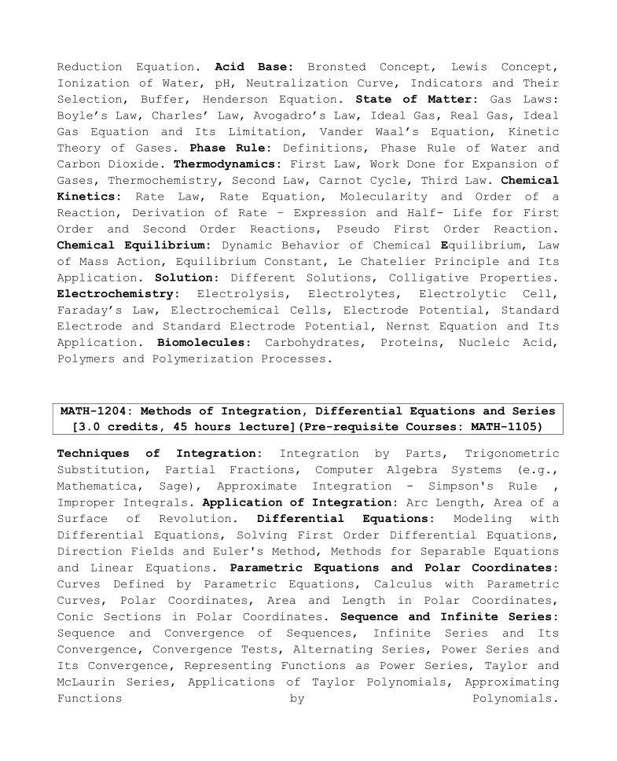

## 📘 MATH-1204: Methods of Integration, Differential Equations and Series

### 👨‍🏫 Course Teacher  
**Dr. Nepal Chandra Roy**  
Associate Professor, University of Dhaka

---

### 📚 Reference Books

- *Calculus Early Transcendentals*, 10th Edition  
- *BC Das & BN Mukharjee* – *Integral Calculus & Differential Equation*  
- *Shepley L. Ross* – *Differential Equations*, John Wiley and Sons (1985)  
- *A.R. Vasishtha & A.K. Vasistha* – *Integral Calculus*  
- *Amit M. Agarwal* – *Integral Calculus*  
- *H. Kishan* – *Integral Calculus*  
- *S.S. Sastry* – *Introductory Methods of Numerical Analysis*

---

### 📝 Lecture Note

[📎 Follow the Hand Note](https://drive.google.com/file/d/15qxAYXKxCw_KHJpSEif0sRcc80KKv-3x/view?usp=drive_link)

---

### 🧮 Topics Covered

#### ➤ Techniques of Integration
- Integration by Parts  
- Trigonometric Substitution  
- Partial Fractions  
- Computer Algebra Systems (e.g., *Mathematica*, *Sage*)  
- Approximate Integration: *Simpson's Rule*  
- Improper Integrals  

#### ➤ Application of Integration
- Arc Length  
- Area of a Surface of Revolution  

#### ➤ Differential Equations
- Modeling with Differential Equations  
- First Order Differential Equations  
- Direction Fields and Euler's Method  
- Separable and Linear Equations  

📄 [Lecture 1: Differential Equations](./slides/Lecture%201.pdf)  
📄 [Lecture 2: Euler's Method](./slides/Lecture%202%20(Euler's%20method).pdf)  
📄 [Lecture 3: Exact or Total Differential](./slides/Lecture%203%20(Exact%20or%20total%20differential).pdf)  
📄 [Lecture 4: Linear Equations](./slides/Lecture%204%20(Linear%20equation).pdf)

#### ➤ Parametric Equations & Polar Coordinates
- Parametric Curves  
- Calculus with Parametric Curves  
- Polar Coordinates  
- Area & Length in Polar Coordinates  
- Conic Sections in Polar Coordinates  

#### ➤ Sequence and Infinite Series
- Sequences & Convergence  
- Infinite Series & Convergence Tests  
- Alternating and Power Series  
- Taylor & Maclaurin Series  
- Polynomial Approximations  

📄 [Mathematical Modeling](./slides/Mathematical%20modeling.pdf)

---

### 🗂️ Syllabus Preview

---