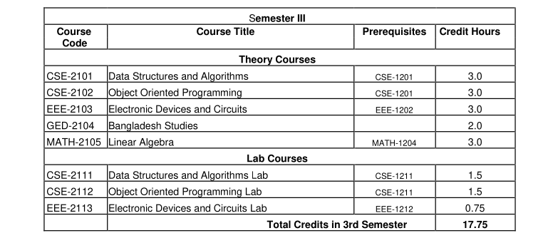
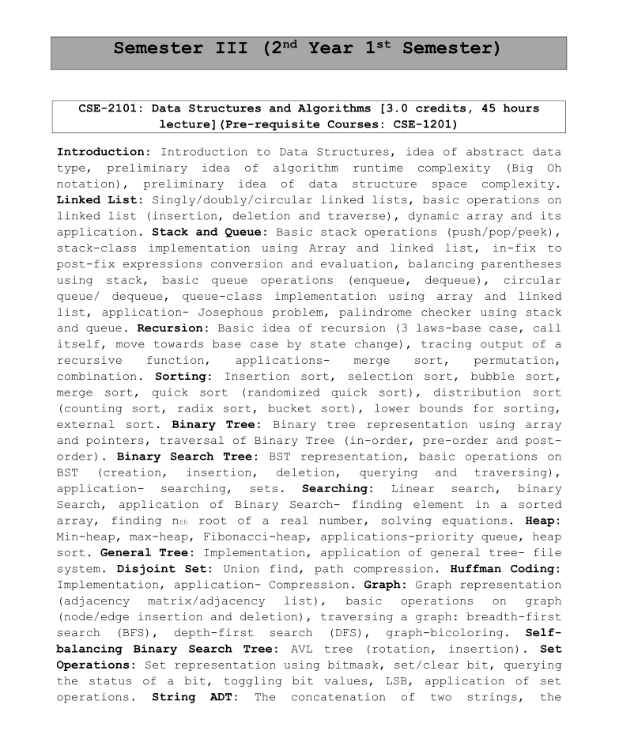
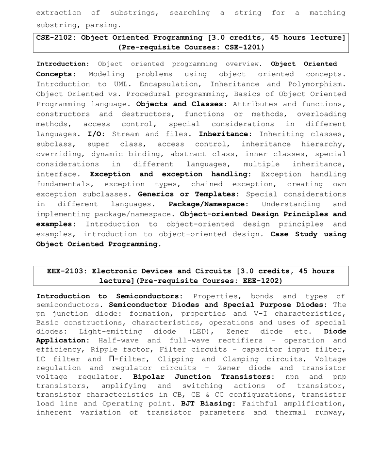
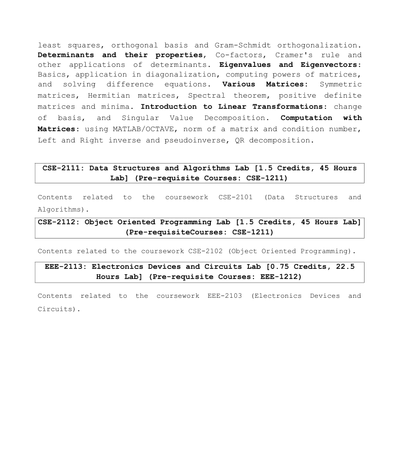

## Semester III (2nd Year 1st Semester)

- [CSE-2101: Data Structures and Algorithms](./cse_2101/)
- [CSE-2102: Object Oriented Programming](./cse_2102/)
- [EEE-2103: Electronic Devices and Circuits](./eee_2103/)
- [GED-2104: Bangladesh Studies](./ged_2104/)
- [MATH-2105: Linear Algebra](./math_2105/)
- CSE-2111: Data Structures and Algorithms Lab

  What a learn in DSA, all documented here in
  [DSA A-Z](https://github.com/eyasir329/DSA) this repository.

  Also I make a project called [Parking Lot Management](https://github.com/eyasir329/parking_lot_management) using c programming with the help of DSA.

- CSE-2112: Object Oriented Programming Lab

      As a part of this lab, I learn Java Programming Languages.

  [Java Programming BootCamp](https://github.com/eyasir329/java_bootcamp)

  Also I make a OOP Project called [Object Detection using image processing in java](https://github.com/eyasir329/image_processing_using_java) with the help of <code>Random Forest</code> Library.

- EEE-2113: Electronics Devices and Circuits Lab

### Course Outline:

### Details Syllabus of my Third semester:

