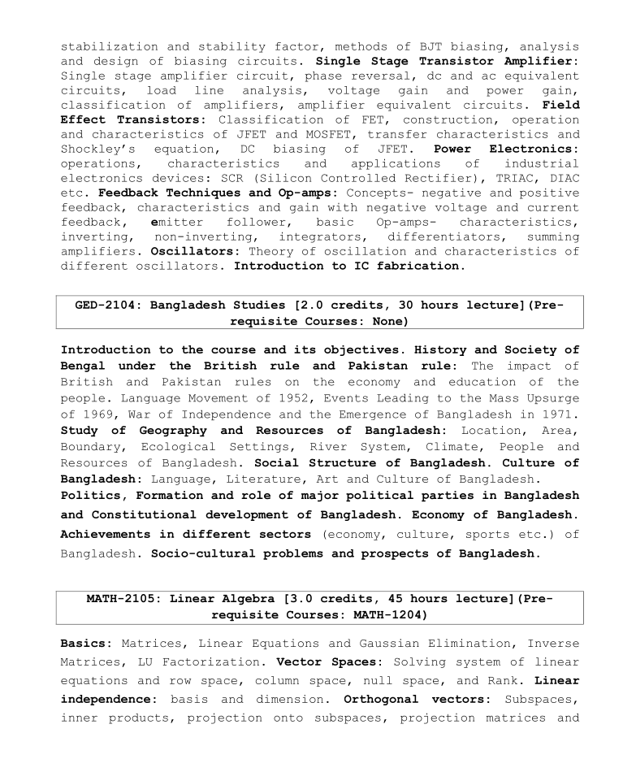

## GED-2104: Bangladesh Studies

Course Teacher

- Dr. Shantanu Majumder, Professor, Department of Political Science, University of Dhaka

Reference Books

- বাংলাদেশ রাজনীতি সরকার ও শাসনতান্ত্রিক উন্নয়ন (১৭৫৭-২০১৮) by ড. হারুন-অর-রশিদ
- গনতন্ত্র-ঘাটতি:বিশ্ব, দক্ষিন এশিয়া ও বাংলাদেশ, শান্তনু মজুমদার

##

### Introduction to the course and its objectives.

### History and Society of Bengal under the British rule and Pakistan rule:

    The impact of British and Pakistan rules on the economy and education of the
    people. Language Movement of 1952, Events Leading to the Mass Upsurge
    of 1969, War of Independence and the Emergence of Bangladesh in 1971.

Battle of Palashi

- https://archive.org/details/in.ernet.dli.2015.298569/page/n43/mode/1up?view=theater  [পৃষ্ঠা ৪১ পর্যন্ত]
- https://bn.banglapedia.org/index.php/%E0%A6%AA%E0%A6%B2%E0%A6%BE%E0%A6%B6%E0%A7%80%E0%A6%B0_%E0%A6%AF%E0%A7%81%E0%A6%A6%E0%A7%8D%E0%A6%A7
- https://www.nam.ac.uk/explore/battle-plassey

Bengal Renaissance

- https://bn.banglapedia.org/index.php?title=বঙ্গীয়_রেনেসাঁ
- https://en.banglapedia.org/index.php/Bengal_Renaissance
- https://www.britannica.com/topic/Bengali-Renaissance

Sepoy Mutiny

- https://bn.banglapedia.org/index.php/%E0%A6%B8%E0%A6%BF%E0%A6%AA%E0%A6%BE%E0%A6%B9%E0%A6%BF_%E0%A6%AC%E0%A6%BF%E0%A6%AA%E0%A7%8D%E0%A6%B2%E0%A6%AC,_%E0%A7%A7%E0%A7%AE%E0%A7%AB%E0%A7%AD

Mark Cartwright, Sepoy Mutiny

- https://www.worldhistory.org/Sepoy_Mutiny/

Muslim Sahitya-Samaj

- https://bn.banglapedia.org/index.php/মুসলিম_সাহিত্য-সমাজ
- https://bangla.thedailystar.net/node/198025

### Study of Geography and Resources of Bangladesh:

    Location, Area,
    Boundary, Ecological Settings, River System, Climate, People and
    Resources of Bangladesh.

### Social Structure of Bangladesh.

### Culture of Bangladesh:

    Language, Literature, Art and Culture of Bangladesh.

### Politics, Formation and role of major political parties in Bangladesh and Constitutional development of Bangladesh.

[Political Development in Bangladesh (1971-2023)](./slides/BD%201971-2023.docx)

### Economy of Bangladesh.

### Achievements in different sectors

    (economy, culture, sports etc.) of
    Bangladesh.

### Socio-cultural problems and prospects of Bangladesh.

What is Liberal Democracy?
"Liberal DemocracY", Europen Center for Populism Studies

- https://www.populismstudies.org/Vocabulary/liberal-democracy/

Shantanu Majumder, "The Future of Liberal Democracy in Bangladesh after the COVID-19 Pandemic", FES, 2021

- https://library.fes.de/pdf-files/bueros/bangladesch/17974.pdf

#

#### Course Outline

