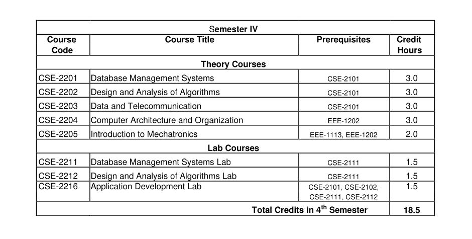
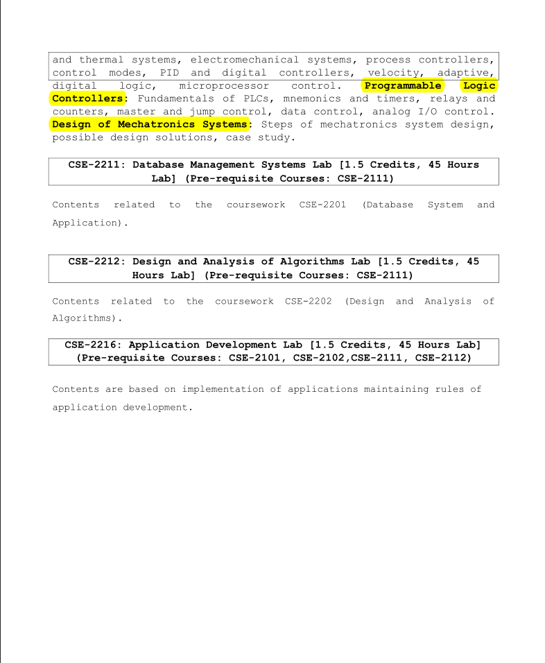

## Semester IV (2nd Year 2nd Semester)

- [CSE-2201: Database Management Systems](./cse_2201/)
- [CSE-2202: Design and Analysis of Algorithms](./cse_2202/)
- [CSE-2203: Data and Telecommunication](./cse_2203/)
- [CSE-2204: Computer Architecture and Organization](./cse_2204/)
- [EEE-2205: Introduction to Mechatronics](./eee_2205/)
- CSE-2211: Database Management Systems Lab

  What I learn in database (MySQL), all documented here in
  [SQL BootCamp](https://github.com/eyasir329/ultimate_mysql_bootcamp) this repository.

- CSE-2212: Design and Analysis of Algorithms Lab

- CSE-2216: Application Development Lab

  As a part of CSE-2216 and CSE-2211, I make a project name [eduFlow329](https://github.com/eyasir329/eduflow329) :- It's a complete school management system.

### Course Outline:

### Details Syllabus of my 4th semester:

