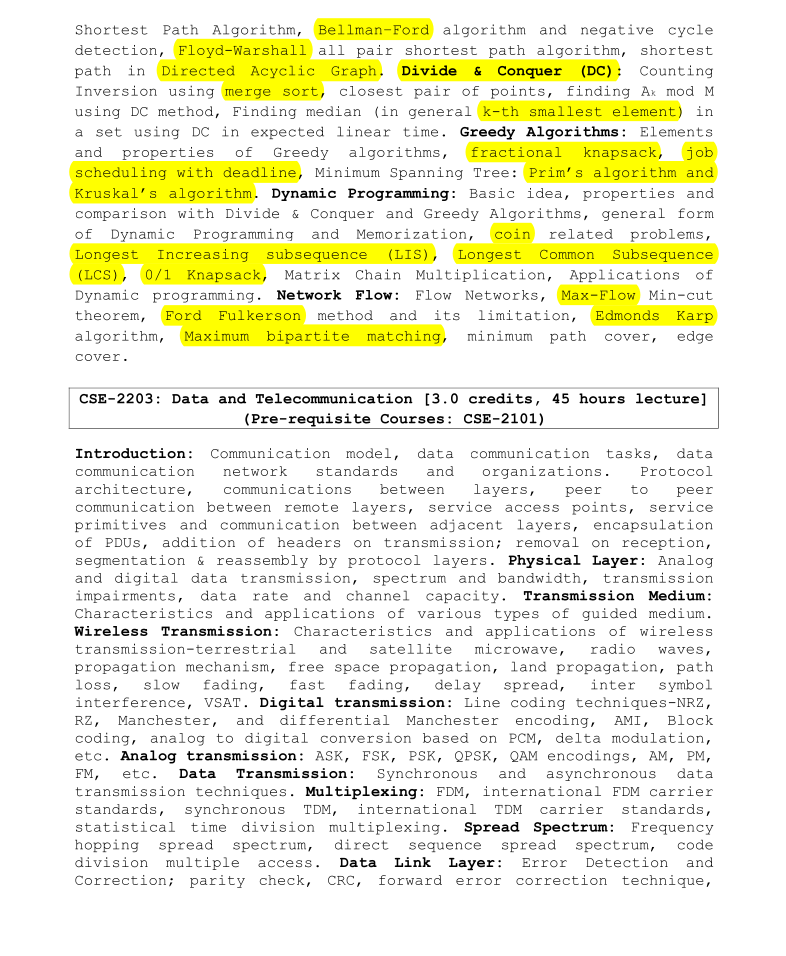

## CSE-2201: Database Management Systems

Course Teacher

- Sharad Hasan, Lecturer, Dept. of CSE,
  Sheikh Hasina University

Reference Books

- Introduction to Algorithms by Thomas H. Cormen (4th Edition)

##

### Introduction:

    Introduction to Algorithms, role of algorithms in
    computing with respect to state of the art researches.

### Complexity Analysis and Recurrence Relation:

    Asymptotic notations, growth of a
    function, methods to solve recurrence relation- Substitution method,
    Recursion tree method, Master method.

[Algorithm Design Techniques](./slides/CSE-2202-Lecture-03-Algorithm%20Design%20Techniques%20-.pptx)

### Graph Traversal:

    Review of Breadth first search (BFS), Depth first search (DFS), Topological
    Sort, Strongly Connected Components, Euler Path, Articulation Point,
    Bridge, Bi-connected Components.

[Graph Algorithms](./slides/CSE-2202-Lecture-08%20-%20Graph%20Algorithm.pdf)

### Shortest Path Algorithms:

    Dijkstra’s Shortest Path Algorithm, Bellman–Ford algorithm and negative cycle
    detection, Floyd-Warshall all pair shortest path algorithm, shortest
    path in Directed Acyclic Graph.

### Divide & Conquer (DC):

    Counting Inversion using merge sort, closest pair of points, finding Ak mod M
    using DC method, Finding median (in general k-th smallest element) in
    a set using DC in expected linear time.

[Divide and Conquer](./slides/CSE-2202-Lecture-07%20-%20Divide%20and%20Conquer.pdf)

### Greedy Algorithms:

    Elements and properties of Greedy algorithms, fractional knapsack, job
    scheduling with deadline, Minimum Spanning Tree: Prim’s algorithm and
    Kruskal’s algorithm.

[Greedy Method](./slides/CSE-2202-Lecture-06-Greedy%20Method.pdf)

### Dynamic Programming:

    Basic idea, properties and comparison with Divide & Conquer and Greedy Algorithms, general form
    of Dynamic Programming and Memorization, coin related problems,
    Longest Increasing subsequence (LIS), Longest Common Subsequence
    (LCS), 0/1 Knapsack, Matrix Chain Multiplication, Applications of
    Dynamic programming.

[Dynamic Programming](./slides/CSE-2202-Lecture-09%20-%20Dynamic%20Programming.pdf)

### Network Flow:

    Flow Networks, Max-Flow Min-cut
    theorem, Ford Fulkerson method and its limitation, Edmonds Karp
    algorithm, Maximum bipartite matching, minimum path cover, edge
    cover.

#### Course Outline

