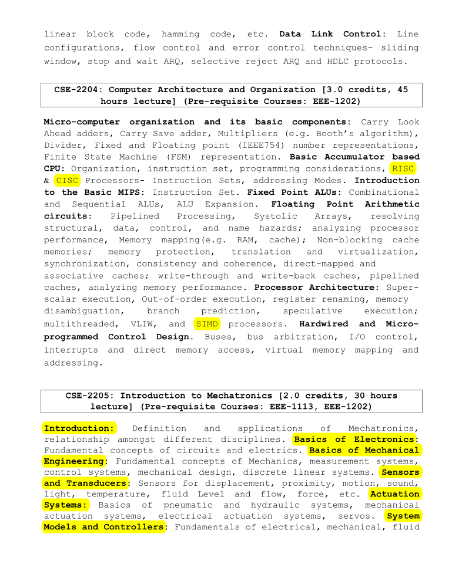

## 💻 **CSE-2204: Computer Architecture and Organization**

### 👨‍🏫 **Course Teacher**  
**Abdullah Al Shiam**  
*Lecturer*  
Department of CSE, Sheikh Hasina University

---

### 📘 **Reference Book**  
- **Computer System Architecture**, 3rd Edition – *Morris Mano*

---

### 🧠 **Course Content Overview**

#### 🔹 **Introduction:**
- **Key Concepts**:  
  - Microcomputer organization and its basic components  
  - Carry Look-Ahead adders, Carry Save adder  
  - Multipliers (e.g., Booth’s algorithm), Dividers  
  - Fixed and Floating point (IEEE754) number representations  
  - Finite State Machine (FSM) representation  
📄 [**Introduction**](./slides/Section1.pptx)

---

#### 🔹 **Micro-computer Organization and Basic Components:**
- **Topics**:  
  - Carry Look-Ahead adders  
  - Carry Save adder  
  - Multiplication and Division algorithms (Booth’s Algorithm)  
  - Fixed and floating-point number representation (IEEE754 standard)  
  - Finite State Machine (FSM) representation

---

#### 🔹 **Basic Accumulator-Based CPU:**
- **Key Concepts**:  
  - Organization, instruction set, programming considerations  
  - RISC vs. CISC Processors  
  - Instruction sets, addressing modes  
📄 [**Machine Instructions**](./slides/Section2.pptx)

---

#### 🔹 **Introduction to Basic MIPS:**
- **Topics**:  
  - Basic instruction set of MIPS architecture

---

#### 🔹 **Fixed Point ALUs:**
- **Key Concepts**:  
  - Combinational and Sequential ALUs  
  - ALU expansion techniques

---

#### 🔹 **Floating Point Arithmetic Circuits:**
- **Topics**:  
  - Pipelined processing  
  - Systolic arrays  
  - Addressing structural, data, control, and name hazards  
  - Processor performance analysis  
  - Memory mapping (RAM, cache), non-blocking cache memories  
  - Memory protection, translation, and virtualization  
  - Synchronization, consistency, and coherence  
  - Cache types: direct-mapped, associative, write-through, and write-back  
  - Pipelined caches, memory performance analysis  
📄 [**Processing Unit**](./slides/Section3.pptx)

---

#### 🔹 **Processor Architecture:**
- **Key Concepts**:  
  - Superscalar execution  
  - Out-of-order execution  
  - Register renaming, memory disambiguation  
  - Branch prediction, speculative execution  
  - Multithreaded, VLIW (Very Long Instruction Word), and SIMD (Single Instruction Multiple Data) processors  
📄 [**Composite Architecture**](./slides/Section6.pptx)

---

#### 🔹 **Control Design:**
- **Topics**:  
  - Hardwired and Micro-programmed Control Design  
  - Buses and bus arbitration  
  - I/O control, interrupts, and direct memory access (DMA)  
  - Virtual memory mapping and addressing  
📄 [**I/O Organization**](./slides/Section4.pptx)  
📄 [**Memory Organization**](./slides/Section5.pptx)

---

### 📝 **Course Outline**  

---