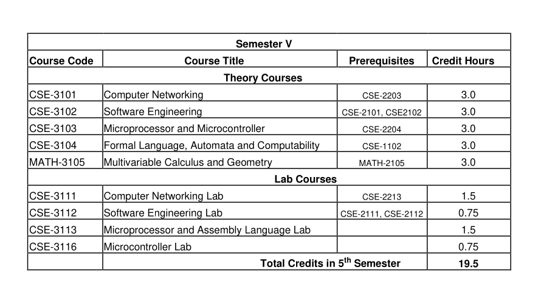

## 🎓 Semester V — 3rd Year 1st Semester

### 📘 Theory Courses
- 🔗 [**CSE-3101: Computer Networking**](./cse_3101/)
- 🔗 [**CSE-3102: Software Engineering**](./cse_3102/)
- 🔗 [**CSE-3103: Microprocessor & Microcontroller**](./cse_3103/)
- 🔗 [**CSE-3104: Finite Language, Automata, and Computability**](./cse_3104/)
- 🔗 [**MATH-3105: Multivariate Calculus and Geometry**](./math_3105/)

---

### 🧪 Lab Courses

- 🔗[**CSE-3111: Computer Networking Lab**](./cse_3111/)
- **CSE-3112: Software Engineering Lab**  
  🔧 *Project:*  
  [🧭 TourMate](https://github.com/eyasir329/tourmate) — A complete **tour and hotel management system**.

- 🔗 [**CSE-3113: Microprocessor and Assembly Language Lab**](./cse_3113/)
- **CSE-3116: Microcontroller Lab**  
  🔧 *Project:*  
  [🚗 ESP32 Surveillance Car](https://github.com/eyasir329/autonomous_car_using_esp32) — A real-time **ESP32-based remote surveillance system**.

---

### 📄 Course Outline Preview

---

### 📚 Detailed Syllabus Snapshots

---
