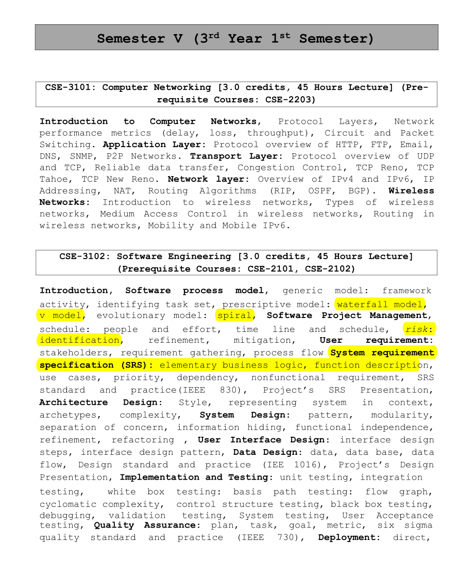

## 💻 CSE-3102: Software Engineering

### 👨‍🏫 Course Teacher  
**Abdullah Al Shiam**  
*Lecturer*, Dept. of CSE, Sheikh Hasina University, Netrokona

---

### 📚 Reference Books  
- **_Software Engineering_**, 9th Edition – *Ian Sommerville*  
- *Software Engineering: A Practitioner’s Approach*, 7th Edition – *Roger S. Pressman, Ph.D.*

---

### 🧭 Course Content Overview

#### 🔹 **Introduction & Software Process Models**
- Generic Model: Framework & Activities  
- Task Sets, Prescriptive Models: Waterfall, V-Model  
- Evolutionary Models: Spiral  
📄 [Intro](./slides/CSE-3102_Lecture%201.pdf)  
📄 [Lifecycle & Models](./slides/Lecture%201,%202,%203%20Software%20Engineering.pdf)  
📄 [SDLC Models](./slides/Lecture%202%20SDLC%20MODELS.pptx)

---

#### 🔹 **Software Project Management & Scheduling**
- People, Effort, Timeline, Risk Identification & Mitigation  
📄 [Project Management](./slides/Lecture%208%20Software%20Project%20Management.pptx)

---

#### 🔹 **Requirements Engineering**
- Stakeholders, Requirement Gathering, Process Flow  
📄 [Gathering Requirements](./slides/Lecture%204%20Gathering%20Requirements%20-%20Requirements%20Engineering.pptx)

---

#### 🔹 **System Requirement Specification (SRS)**
- Business Logic, Functional & Non-functional Requirements  
- Use Cases, IEEE 830 Standard, SRS Documentation & Presentation

---

#### 🔹 **Architecture Design**
- Architectural Styles  
- Context Representation, Archetypes, Managing Complexity

---

#### 🔹 **System Design**
- Design Patterns, Modularity, Separation of Concerns  
- Information Hiding, Functional Independence, Refactoring

---

#### 🔹 **User Interface (UI) Design**
- UI Design Steps  
- UI Design Patterns

---

#### 🔹 **Data Design**
- Data Modeling, Databases, Data Flow  
- Design Standards (IEEE 1016), Project Design Presentation  
📄 [Modeling](./slides/Lecture%205%20Modeling.pptx)

---

#### 🔹 **Implementation & Testing**
- Unit & Integration Testing  
- White Box Testing (Flow Graph, Cyclomatic Complexity)  
- Black Box Testing, Debugging, Validation, System & UAT  
📄 [Testing](./slides/Software%20Testing.pdf)

---

#### 🔹 **Software Quality Assurance**
- QA Plan, Tasks, Metrics  
- Six Sigma, IEEE 730 Standards  
📄 [Metrics & Measurements](./slides/Lecture%209%20Metric%20&%20Measurment.pptx)

---

#### 🔹 **Deployment Strategies**
- Direct, Parallel, and Pilot Deployments

---

#### 🔹 **Maintenance & Reengineering**
- Maintainability, Supportability, Final Project Presentation

---

### 🧾 Syllabus Preview  
  

---
