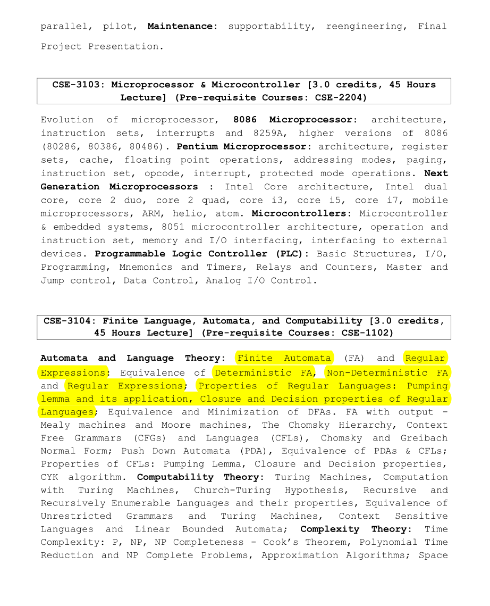
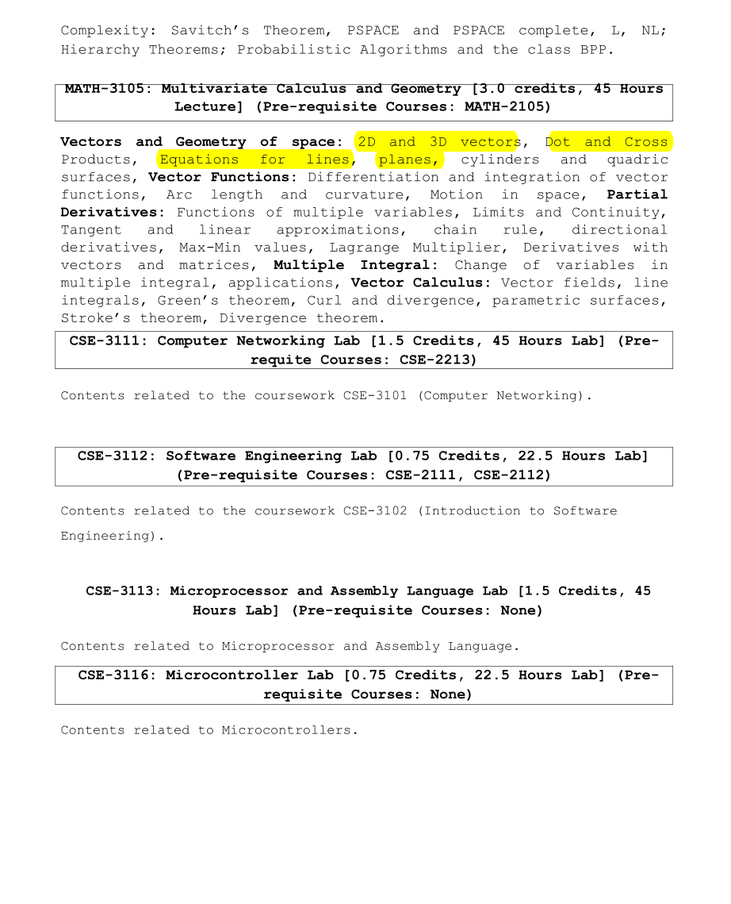

## CSE-3104: Finite Language, Automata, and Computability

Course Teacher

- Md. Anwarul Islam, Lecturer,  Dept. of CSE,
  Sheikh Hasina University

Reference Books

- Introduction to Automata Theory Languages and Computation by John E. Hopcroft (2nd Edition)
- Automata, Languages and Computation, THIRD EDITION, K.l.P. MISHRA

##

### Automata and Language Theory:

    Finite Automata (FA) and Regular Expressions: Equivalence of Deterministic FA, Non-Deterministic FA
    and Regular Expressions; Properties of Regular Languages: Pumping
    lemma and its application, Closure and Decision properties of Regular
    Languages; Equivalence and Minimization of DFAs. FA with output -
    Mealy machines and Moore machines, The Chomsky Hierarchy, Context
    Free Grammars (CFGs) and Languages (CFLs), Chomsky and Greibach
    Normal Form; Push Down Automata (PDA), Equivalence of PDAs & CFLs;
    Properties of CFLs: Pumping Lemma, Closure and Decision properties,
    CYK algorithm.

[Automata Theory, Grammars and Languages](./slides/Lecture%2001.ppt.pdf) 
[DFA and NFA](./slides/Lecture%2002.pptx.pdf) 
[Equivalence of DFA & NFA](./slides/Lecture%2003.pptx.pdf) 
[Regular Expressions and DFAs](./slides/Lecture%2004.ppt.pdf) 
[Regular Expression](./slides/Lecture%2005.pptx.pdf) 
[Automata Theory](./slides/Lecture%2007.pptx.pdf)

### Computability Theory:

    Turing Machines, Computation
    with Turing Machines, Church-Turing Hypothesis, Recursive and
    Recursively Enumerable Languages and their properties, Equivalence of
    Unrestricted Grammars and Turing Machines,
    Context Sensitive
    Languages and Linear Bounded Automata;

### Complexity Theory:

    Time Complexity: P, NP, NP Completeness - Cook’s Theorem, Polynomial Time
    Reduction and NP Complete Problems, Approximation Algorithms; Space Complexity: Savitch’s Theorem, PSPACE and PSPACE complete, L, NL;
    Hierarchy Theorems; Probabilistic Algorithms and the class BPP.

#### Course Outline

