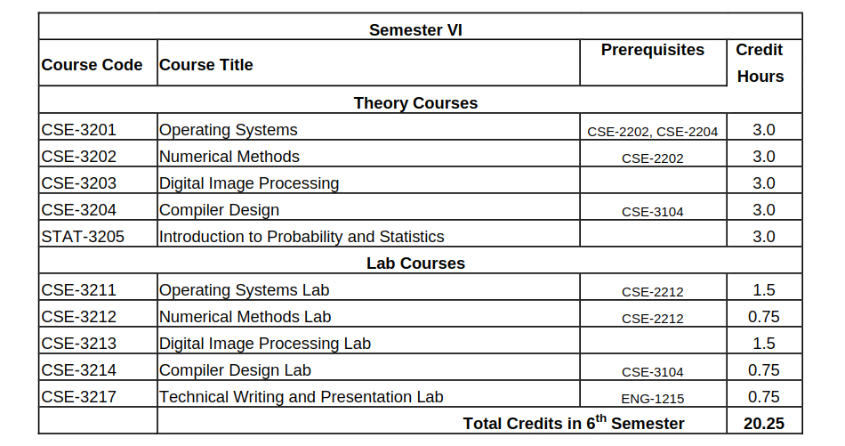
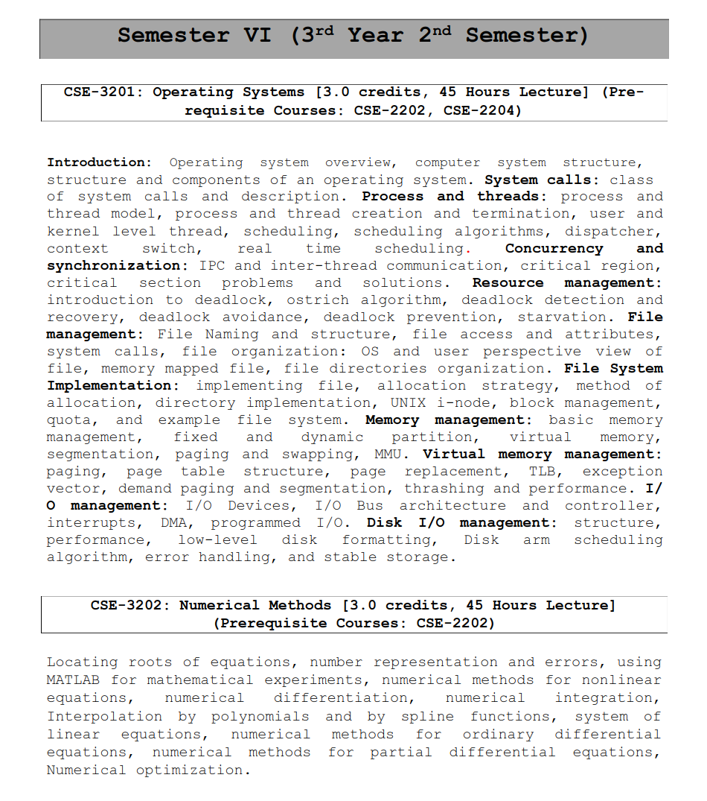
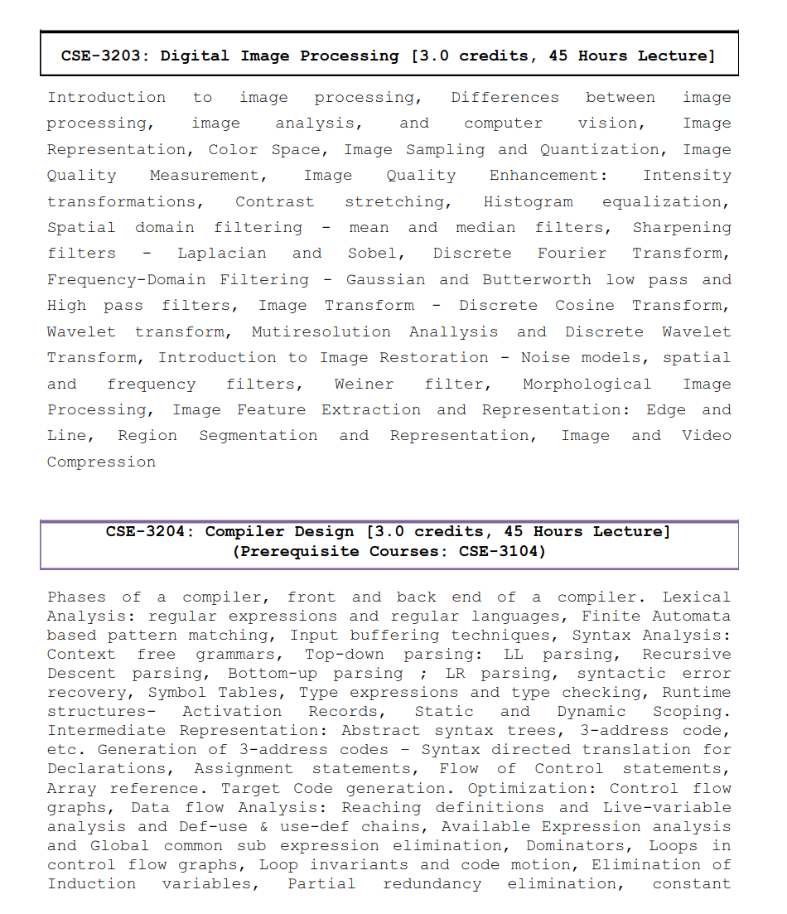
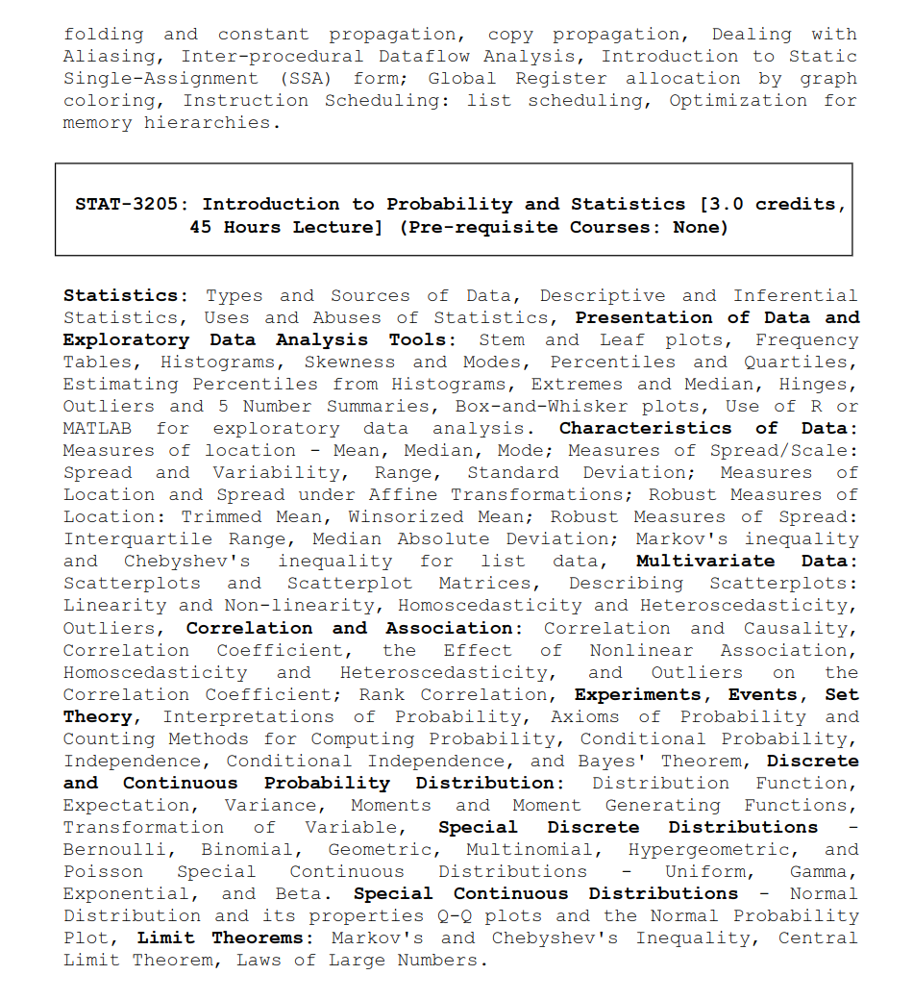
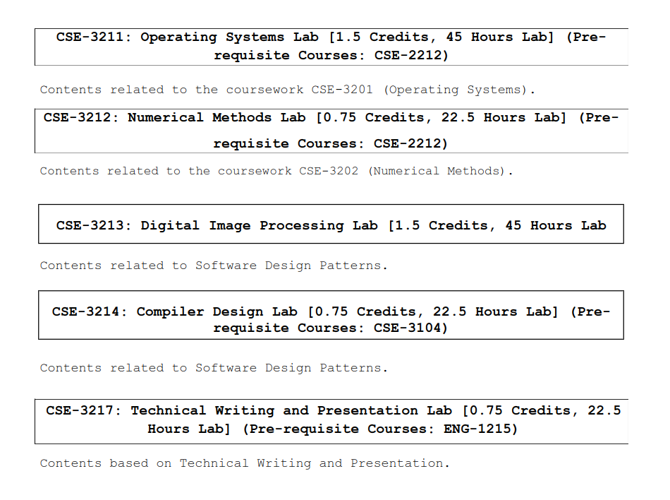

## 🎓 **Semester VI — 3rd Year 2nd Semester**

### 📘 **Theory Courses**:
- 🔗 [**CSE-3201: Operating Systems**](./cse_3201/)
- 🔗 [**CSE-3202: Numerical Methods**](./cse_3202/)
- 🔗 [**CSE-3203: Digital Image Processing**](./cse_3203/)
- 🔗 [**CSE-3204: Compiler Design**](./cse_3204/)
- 🔗 [**STAT-3205: Introduction to Probability and Statistics**](./stat_3205/)

---

### 🧪 **Lab Courses**:
- 🔗 [**CSE-3211: Operating Systems Lab**](./cse_3211/)
- 🔗 [**CSE-3212: Numerical Methods Lab**](./cse_3212/)
- 🔗 [**CSE-3213: Digital Image Processing Lab**](./cse_3213/)
- 🔗 [**CSE-3214: Compiler Design Lab**](./cse_3214/)
- 🔗 [**CSE-3217: Technical Writing and Presentation Lab**](./cse_3217/)

---

### 📄 **Course Outline Preview**:

---

### 📚 **Detailed Syllabus Snapshots**:

---