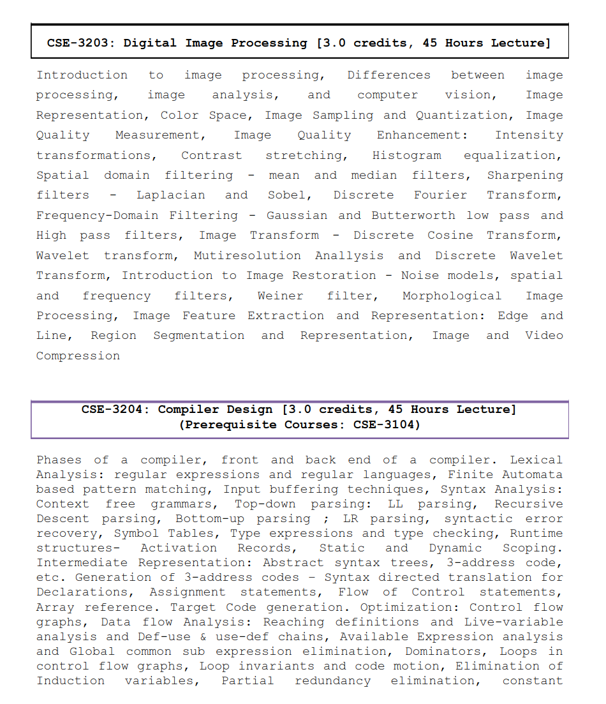

## 🖼️ **CSE-3203: Digital Image Processing**

### 👨‍🏫 **Course Teacher**

**Abdullah Al Shiam**  
_Assistant Professor_  
Department of CSE, Netrokona University, Netrokona

---

### 📚 **Reference Books**

- **Digital Image Processing**, _Rafael C. Gonzalez_
- **Machine Vision**, _David Vernon_

---

Notes -> https://drive.google.com/file/d/1CX6TTids6A8lcqxh6f6YkVytsBniP7Q-/view?usp=sharing

### 🧩 **Course Content Overview**

#### 🔹 **Introduction to Image Processing**

- Differences between Image Processing, Image Analysis, and Computer Vision
- Image Representation
- Color Space

#### 🔹 **Image Sampling and Quantization**

- Image Quality Measurement

#### 🔹 **Image Quality Enhancement**

- Intensity Transformations
- Contrast Stretching
- Histogram Equalization

#### 🔹 **Spatial Domain Filtering**

- Mean and Median Filters
- Sharpening Filters: Laplacian and Sobel

#### 🔹 **Frequency Domain Filtering**

- Discrete Fourier Transform (DFT)
- Gaussian and Butterworth Low Pass and High Pass Filters

#### 🔹 **Image Transform**

- Discrete Cosine Transform (DCT)
- Wavelet Transform
- Multiresolution Analysis and Discrete Wavelet Transform

#### 🔹 **Introduction to Image Restoration**

- Noise Models
- Spatial and Frequency Filters
- Wiener Filter

#### 🔹 **Morphological Image Processing**

- Basic Operations
- Applications in Image Analysis

#### 🔹 **Image Feature Extraction and Representation**

- Edge and Line Detection
- Region Segmentation and Representation

#### 🔹 **Image and Video Compression**

- Techniques and Algorithms

---

### 🧾 **Syllabus Preview**

---
