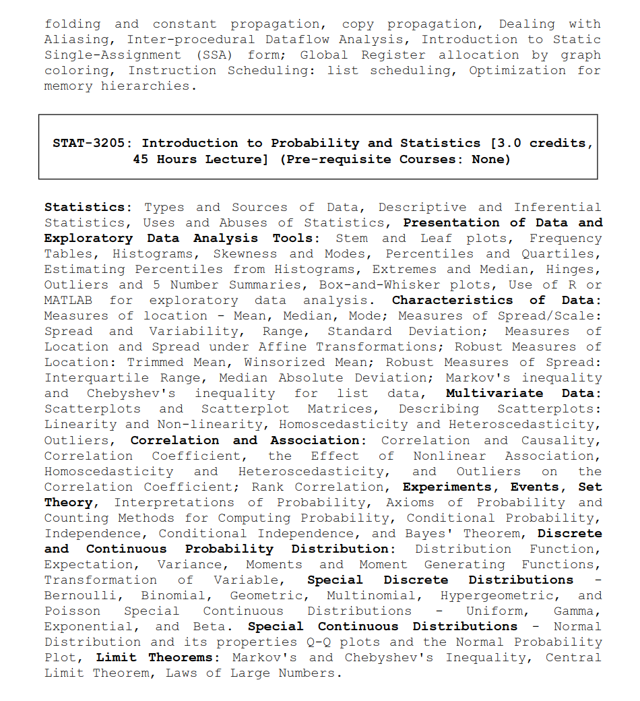

## 📊 **STAT-3205: Introduction to Probability and Statistics**

### 👨‍🏫 **Course Teacher**

**Md. Sifat Ar Salan**  
_Assistant Professor_  
Department of Statistics and Data Science, Jahangirnagar University

---

### 📚 **Reference Books**

- **Introductory Statistics**, _Prem S. Mann_
- **Statistical Techniques in Business and Economics**, _Lind_

---

Notes -> https://drive.google.com/file/d/1VuzLQ_zZzpqWAFr4xt19eSg5mgMeOSts/view?usp=drive_link

### 🧩 **Course Content Overview**

#### 🔹 **Introduction to Statistics**

- Types and Sources of Data
- Descriptive and Inferential Statistics
- Uses and Abuses of Statistics

#### 🔹 **Presentation of Data**

- Exploratory Data Analysis Tools:
  - Stem-and-Leaf Plots
  - Frequency Tables
  - Histograms
  - Skewness and Modes
  - Percentiles and Quartiles
  - Estimating Percentiles from Histograms
  - Extremes and Median
  - Hinges, Outliers, and 5-Number Summaries
  - Box-and-Whisker Plots
- Use of R or MATLAB for Exploratory Data Analysis

#### 🔹 **Characteristics of Data**

- Measures of Location: Mean, Median, Mode
- Measures of Spread/Scale: Range, Standard Deviation
- Measures of Location and Spread under Affine Transformations
- Robust Measures of Location: Trimmed Mean, Winsorized Mean
- Robust Measures of Spread: Interquartile Range, Median Absolute Deviation
- Markov's Inequality and Chebyshev's Inequality for List Data

#### 🔹 **Multivariate Data**

- Scatterplots and Scatterplot Matrices
- Describing Scatterplots:
  - Linearity and Non-linearity
  - Homoscedasticity and Heteroscedasticity
  - Outliers
- Correlation and Association:
  - Correlation and Causality
  - Correlation Coefficient
  - Effect of Nonlinear Association, Homoscedasticity, Heteroscedasticity, and Outliers on the Correlation Coefficient
  - Rank Correlation

#### 🔹 **Probability Theory**

- Experiments, Events, Set Theory
- Interpretations of Probability
- Axioms of Probability
- Counting Methods for Computing Probability
- Conditional Probability, Independence, Conditional Independence
- Bayes' Theorem

#### 🔹 **Probability Distributions**

- Discrete and Continuous Probability Distributions
  - Distribution Function
  - Expectation, Variance, Moments, and Moment Generating Functions
  - Transformation of Variables
- Special Discrete Distributions:
  - Bernoulli, Binomial, Geometric, Multinomial, Hypergeometric, Poisson
- Special Continuous Distributions:
  - Uniform, Gamma, Exponential, Beta
- Normal Distribution and Its Properties
- Q-Q Plots and Normal Probability Plot

#### 🔹 **Limit Theorems**

- Markov's Inequality and Chebyshev's Inequality
- Central Limit Theorem
- Laws of Large Numbers

---

### 🧾 **Syllabus Preview**

---
